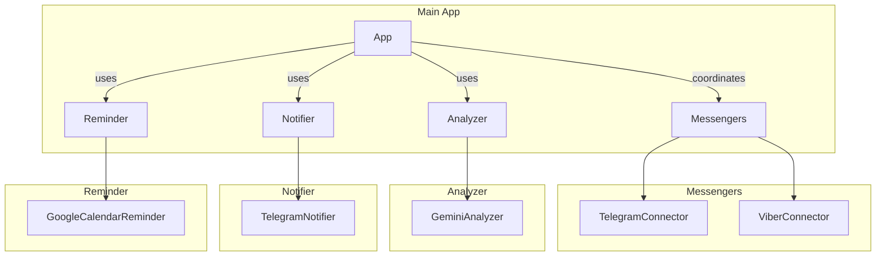

# Secretary

## Overview
A modular application that summarizes unread messages from various messengers (Telegram, Viber) using Gemini AI, sends summaries via Telegram notifications, and can create Google Calendar reminders.

## Features
- Supports Telegram and Viber messengers
- Uses Gemini AI for message summarization
- Configurable summarization prompts per chat
- Scheduled summary generation
- Google Calendar reminder integration
- Modular architecture for easy extension

## Architecture


## Installation
1. Clone the repository:
```bash
git clone https://github.com/yourusername/telegram_agent.git
cd telegram_agent
```

2. Create and activate virtual environment:
```bash
python -m venv venv
source venv/bin/activate
```

3. Install dependencies:
```bash
pip install -r requirements.txt
```

## Configuration
The application uses two configuration files:

1. `config.json` - Non-sensitive settings
2. `secrets.json` - Sensitive credentials (keep private)

### Setup Steps:
1. Copy example files:
```bash
cp config.example.json config.json
cp secrets.example.json secrets.json
```

2. Update `config.json` with your settings:
```json
{
  "messengers": {
    "telegram": {
      "default_prompt": "Your default prompt",
      "chats": [
        {
          "chat_id": -10000000000,
          "prompt_override": "Chat-specific prompt"
        }
      ]
    },
    "viber": {
      "default_prompt": "Viber default prompt"
    }
  },
  "schedule": {
    "interval_minutes": 30
  },
  "reminders": {
    "enabled": false,
    "calendar_id": "your_calendar_id"
  }
}
```

3. Update `secrets.json` with your credentials:
```json
{
  "gemini_api_key": "your_gemini_api_key",
  "telegram": {
    "api_id": "your_api_id",
    "api_hash": "your_api_hash",
    "bot_token": "your_bot_token",
    "bot_owner_id": "your_bot_owner_id"
  },
  "viber": {
    "api_key": "your_viber_api_key"
  },
  "reminders": {
    "service_account_json": "path/to/service_account.json"
  }
}
```

3. Update `secrets.json` with your sensitive credentials.

> Note: The application merges secrets with configuration at runtime.

## Usage
Run the application:
```bash
python run.py
```

## Extending
To add new messengers:
1. Create a new connector in `connectors/` implementing the Messenger interface
2. Add configuration section in `config.json`
3. Update App class to initialize your connector
## Deployment to Render.com

1. Create a new Web Service on Render.com
2. Connect your GitHub repository
3. Use the following settings:
   - Runtime: Python 3
   - Build Command: `pip install -r requirements.txt`
   - Start Command: `python run.py`
4. Set environment variables from secrets.json in the Render dashboard
5. Deploy


## License
MIT