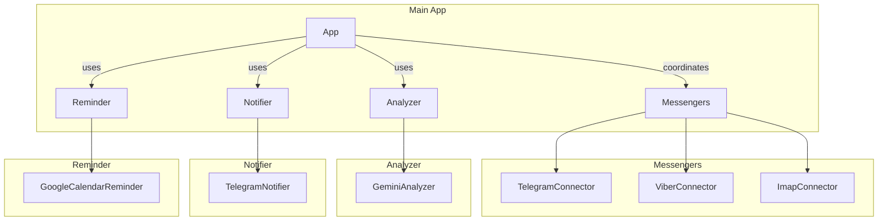

# Secretary

[](https://github.com/xor2003/telegram-agent/actions/workflows/ci.yml)

## Overview
A modular application that summarizes unread messages from various messengers (Telegram, Viber, Email) using Gemini AI, sends summaries via Telegram notifications, and can create Google Calendar reminders.

## Features
- Supports Telegram, Viber, and IMAP email connectors
- Uses Gemini AI for message summarization
- Configurable summarization prompts per chat
- Scheduled summary generation
- Google Calendar reminder integration
- Modular architecture for easy extension

## Architecture


## Installation

### Using `pip`
1.  **Clone the repository:**
    ```bash
    git clone https://github.com/xor2003/telegram-agent.git
    cd telegram-agent
    ```

2.  **Create and activate a virtual environment:**
    ```bash
    python -m venv venv
    source venv/bin/activate
    ```

3.  **Install dependencies:**
    ```bash
    pip install .
    ```

### Using `uv`
1.  **Clone the repository:**
    ```bash
    git clone https://github.com/xor2003/telegram-agent.git
    cd telegram-agent
    ```

2.  **Create and activate a virtual environment:**
    ```bash
    uv venv
    source .venv/bin/activate
    ```

3.  **Install dependencies:**
    ```bash
    uv pip install .
    ```

## Configuration
The application uses two configuration files:
-   `config.json`: Non-sensitive settings
-   `secrets.json`: Sensitive credentials (keep private)

### Setup Steps
1.  **Copy example files:**
    ```bash
    cp config.example.json config.json
    cp secrets.example.json secrets.json
    ```

2.  **Update `config.json`:**
    ```json
    {
      "messengers": {
        "telegram": {
          "default_prompt": "Summarize unread messages",
          "chats": [
            {
              "chat_id": -1001234567890,
              "prompt_override": "Summarize focusing on project updates"
            }
          ]
        },
        "viber": {
          "default_prompt": "Summarize Viber messages"
        },
        "imap": {
            "default_prompt": "Summarize new emails"
        }
      },
      "schedule": {
        "interval_minutes": 30
      },
      "reminders": {
        "enabled": false,
        "calendar_id": "primary"
      }
    }
    ```

3.  **Update `secrets.json`:**
    ```json
    {
      "gemini_api_key": "your_gemini_api_key_here",
      "telegram": {
        "api_id": "your_api_id",
        "api_hash": "your_api_hash",
        "bot_token": "your_bot_token",
        "bot_owner_id": "your_user_id"
      },
      "viber": {
        "api_key": "your_viber_api_key"
      },
      "imap": {
        "email": "your_email@example.com",
        "password": "your_email_password",
        "server": "imap.example.com"
      },
      "reminders": {
        "service_account_json": "path/to/service_account.json"
      }
    }
    ```

> **Note:** The application merges secrets with the configuration at runtime.

## Usage
Run the application:
```bash
python run.py
```

## Extending
To add a new messenger:
1.  Create a new connector in `telegram_agent/connectors/` that implements the `Messenger` interface.
2.  Add its configuration to `config.json` and `secrets.json`.
3.  Update the `App` class in `telegram_agent/app.py` to initialize and use your new connector.

## Deployment to Render.com
1.  Create a new Web Service on Render.com.
2.  Connect your GitHub repository.
3.  Use the following settings:
    -   **Runtime**: Python 3
    -   **Build Command**: `pip install .`
    -   **Start Command**: `python run.py`
4.  Set your environment variables from `secrets.json` in the Render dashboard.
5.  Deploy.

## License
MIT